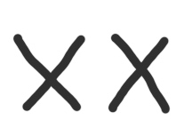
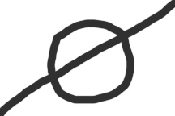
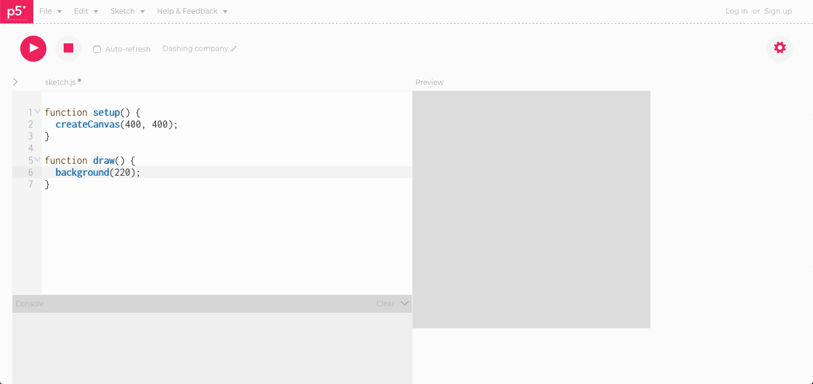
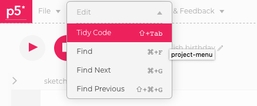
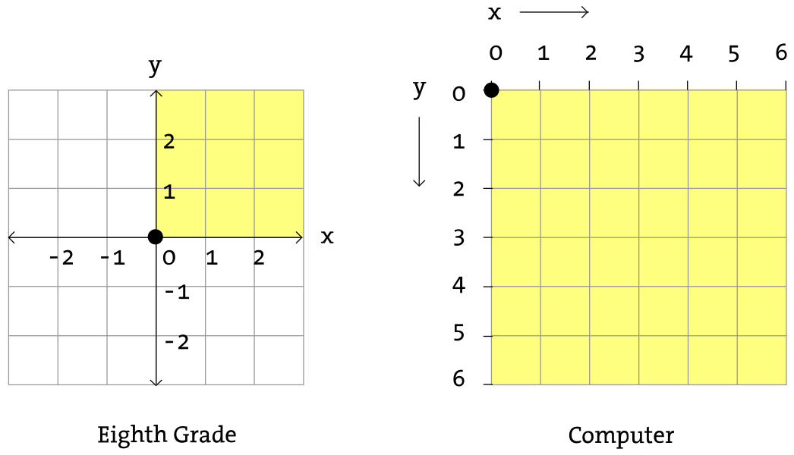
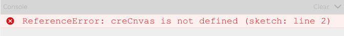
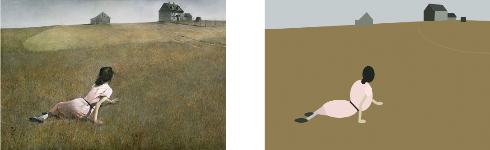

# Week 01

### Overview

1. Hello!
2. Course Overview, Syllabus and Goals
  - Student goals
3. Human Fax Machine
4. Artists who code
5. What is p5.js?
6. Hello World - Our first programming
7. Where to Get Help

# Introduction

An intro to Procedural Art and [Programming art](programming-art.md).

- slides

# Human Fax Machine

You will need
- paper
- pen

With a partner construct a sound language. You will use this to communicate a drawing that one of you will see and attempt to describe to the other via your sounds. No human words can be used.

Example image



<br>
another example image



<br>

# Hello World!

### What is p5.js?

Okay, you've now heard the name p5.js, but what is it?

p5.js is a JavaScript library, that means it makes it easier to code JavaScript, the language of the web. It starts with the original goal of Processing, the programming language created by Ben Fry and Casey Reas to make coding accessible for artists, designers, educators and beginners, and reinterprets this for today's web.

Using the original metaphor of a software sketchbook, p5.js has a full set of drawing functionality. However, you're not limited to your drawing canvas, you can think of your whole browser page as your sketch. For this, p5.js has addon libraries that make it easy to interact with text, input, video, webcams, and sound.


### an intro to the p5js editor

The online editor is a basic code editing toolkit that allows you to write code, run code, visualize the output, and save code.



Main components of the editor:
- Play (Compile) and Stop buttons
- Name of your code sketch
- Code editor
- Visual Output
- Console for error messages and debugging

Additional features:
- Rename the randomized name
- File > Save
- File > Share to get links for the code sketch or just the visual output
- Edit > Tidy Code *(can help with debugging!)*



### Coordinate system

How do we tell the computer where to draw on the screen? We use a coordinate system.

In middle and high school, we created graphs with a X and Y axis. The point 0,0 was in the center of the page.



In p5.js, 0,0 is at the top left of our window. As we move right, X increases. As we move down, Y increases. The top left point is 0,0.

### setup

Setup runs once at the onset of your program. Everything that we want to run once at the beginning of our program goes between the **{** and **}** curly brackets of our ```setup()``` function.

We will be drawing to a digital canvas, which has a width and height that we specify. These are defined in pixels.

```
function setup() {
  createCanvas(600,800);
}
```

This line tells p5js to create a canvas 600 pixels wide by 800 pixels high.
The lines of our program generally end with a semicolon.

### draw

The  draw function starts immediately after the code in ```setup()``` runs, and it happens in a loop. The entire ```draw()``` loop runs approximately 60 times a second, though this can vary as it's dependent on your web browser speed and performance. The lines of code generally are executed one after the other. At the bottom of the draw loop contained in the **{** and **}** brackets it jumps back to the beginning of the draw loop and continues to run again, infinitely, until you click stop or close the web page.

### Drawing shapes

- rectangle
- ellipse
- line
- triangle
- point

### Creating your own shapes

Create a more complex shape using the ```beginShape()``` and ```endShape()``` functions. Reference [page](http://p5js.org/reference/#/p5/beginShape).

## Iterative design and code sketching

p5.js uses the concept of a software sketchbook, and makes it easy to write code, test (by hitting play), and adding more. This is known as an iterative process. It is a normal process of coding to start simple and and continually add to and refine your work.

## Color

A page's background color can be specified
```
background(grayness);
```

Before a shape, specify color with fill

```
fill(grayness); //or fill(r, g, b);
```


#### In-class Exercise

Make your face!

### The Reference

How do you know what commands are available in p5.js?

[The Reference](http://p5js.org/reference/) is the complete list of available p5.js commands. It is broken down by category, and there is also a search feature. Use it to learn how to properly use a particular command.

*We will use the reference so much in this class that it is recommended you consider adding it to your bookmarks bar.*

### Commenting

It's considered good practice to leave notes for yourself in your code. This is especially true in tricky code sections, or any time you think it will help you understand what your code is doing, or if you share your code with someone else. The clearer your comments, the easier it will be for you to understand your code when you open it again in the future.

To make a comment, put two ```//```:where:"string" at the beginning of the line.

```
//This is a comment
```

You can also do multiple line comments. *Note: I rarely use this.*

```
/* this
is a multiple line
comment
*/
```

### Console / Error Messages



The console tells you when you made a mistake. It points out the line where it thinks the mistake was made.

We also use the ```print()``` command in our code to print things in the console for use in debugging. Stay tuned for more info on this in our next class.

## Ways to Find Help

- Visit the p5js [reference](http://p5js.org/reference/)
- Visit [p5js.org](http://p5js.org).
- Check out The Coding Train [tutorials](https://thecodingtrain.com/)
- Visit the [Processing forums p5.js category](https://discourse.processing.org/c/p5js). Search for your topic or ask a question.
- Search on [Stack Overflow](https://stackoverflow.com/questions/tagged/p5.js).
- Visit Einstein Corner.
- Contact me and come to office hours.

# Homework

## Learning
- Buy Getting Started With p5.js book.
- Read Chapter 1, 2 and 3 of Getting Started With  P5JS.
  - it is available on course reserve for 3 hour blocks at the library circulation desk
  - Watch [The Coding Train 1.1 - 1.6](https://youtu.be/yPWkPOfnGsw) videos
- Buy a notebook and bring it to our next class.

## Research

- Read the chapter Program Art or Be Programmed from [New Art Science Affinities](http://millergallery.cfa.cmu.edu/nasabook/newartscienceaffinities.pdf) including the pages from Casey Reas, Rafael Lozano-Hemmer, Jer Thorp, and Golan Levin.
- Pick an artwork from one of these artists. You can visit their websites to find examples. Write a short post about the work. How was it made? What is the concept? What do you find interesting in the work? etc.
- Visit [Creative Applications](http://creativeapplications.net) and [The Creators Project](http://creators.vice.com). They both have articles going back years, so don't necessarily pick the first articles you see.
	- Pick 3 different interactive or digital art projects
	- Prepare a 3 minute presentation on the works.
	- For each project: What is the project? How is it presented (online? exhibition? etc)? What is the concept? Who made it? What do you personally find interesting in it? etc

## Coding  
Select a painting by a famous artist and recreate it in code using primitives (shapes such as point, line, rectangles, ellipses, triangles). You may use createshape. Create the work in the P5JS web editor and post a link to your code sketch on Moodle. **Remember: assignments are due by noon the day of class.**


Example by Joe McKay
