# Pre-history and Early history of Computer Art

# In the beginning - 1960s

The precursor of computer art dates back to 1956–1958

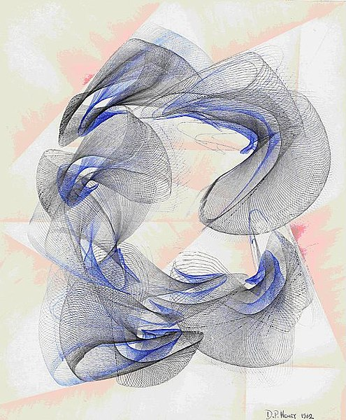  
Desmond Paul Henry, Drawing Machine, 1960

Henry invented the Henry Drawing Machine in 1960

Most artists working with computers were engineers and scientists because computers were generally in scientific research labs.

### Bell Labs

Bell Labs was an early supporter of artists experimenting and working with technology. These include Claude Shannon, Ken Knowlton, Leon Harmon, Lillian Schwartz, Charles Csuri, A. Michael Noll, Edward Zajec, and Billy Klüver, an engineer who also collaborated with Robert Rauschenberg to form Experiments in Art and Technology (EAT) at the Los Angeles County Museum of Art.

Bell Labs supported artists to work with their computers after hours. They supported '9 Evenings: Theatre and Engineering' organised by EAT in 1966. 10 contemporary artists worked with engineers and scientists from Bell Labs to host performances using new technology.

Michael Noll was invited to work at Bell Telephone Laboratories in New Jersey in 1962. He attempted to imitate paints by Piet Mondrian, Bridget Riley and others.

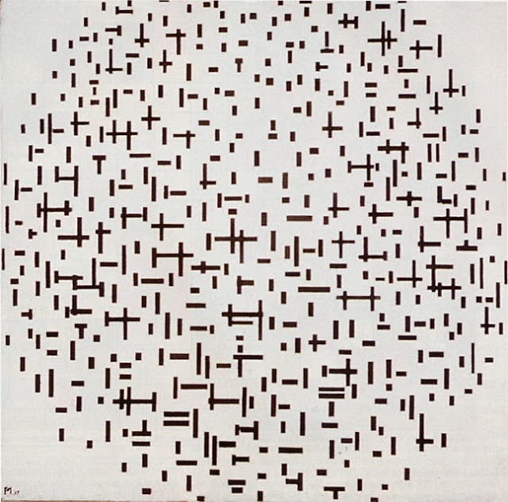  
Mondrian

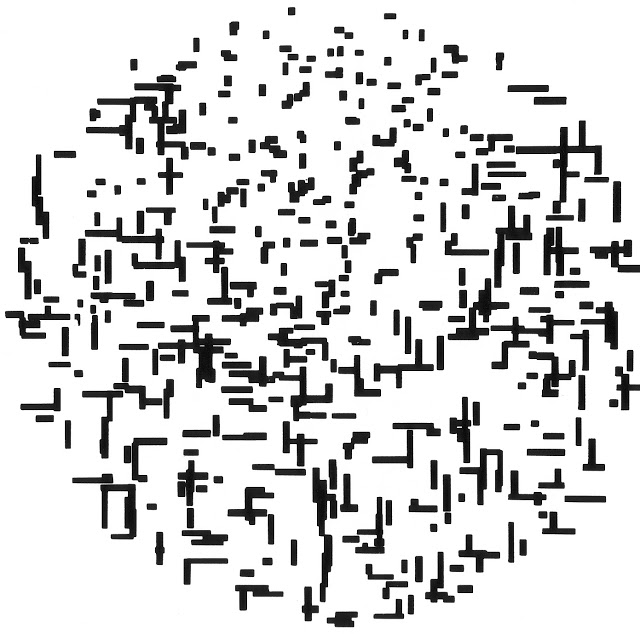  
Noll

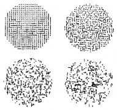

Early computers did not necessarily have displays. One common output was a plotter, which used vector coordinates to direct a drawing pen.

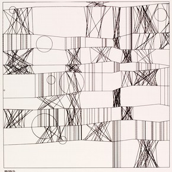  
Frieder Nake, 'Hommage à Paul Klee 13/9/65 Nr.2', 1965. Victoria and Albert Museum.

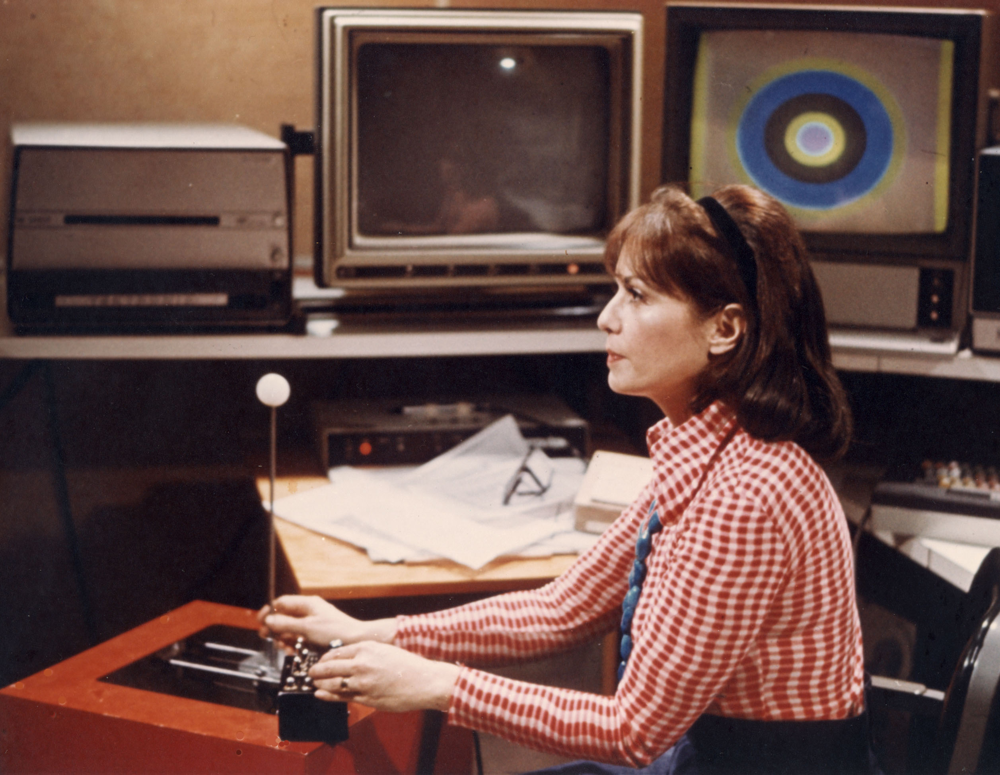  
Lillian Schwartz working at Bell Labs

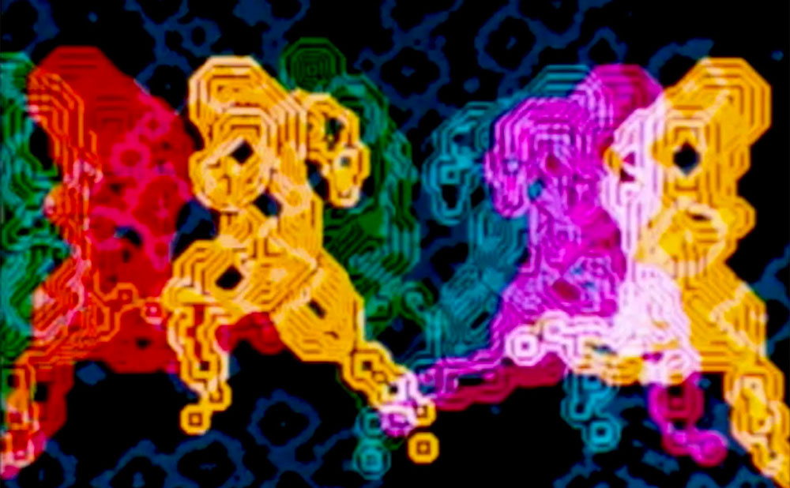  
early work by Lillian Schwartz

### Manfred Mohr

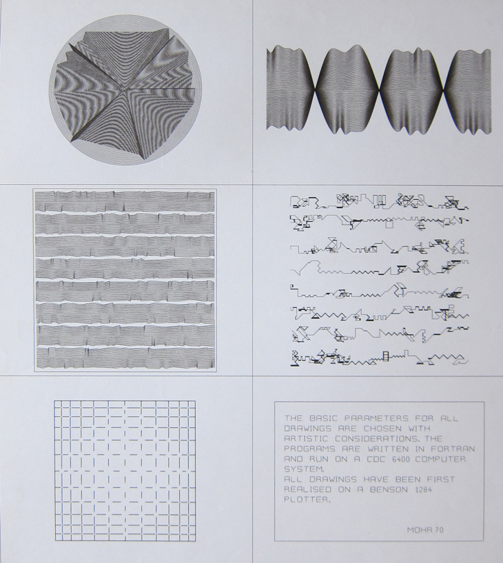

In 1968, the Institute of Contemporary Arts (ICA) in London hosted one of the most influential early exhibitions of computer art called Cybernetic Serendipity. The exhibition included many of whom often regarded as the first digital artists, Nam June Paik, Frieder Nake, Leslie Mezei, Georg Nees, A. Michael Noll, John Whitney, and Charles Csuri.

### 1980s

In the 1980s computers came into the home. Artists began having access to graphical systems.

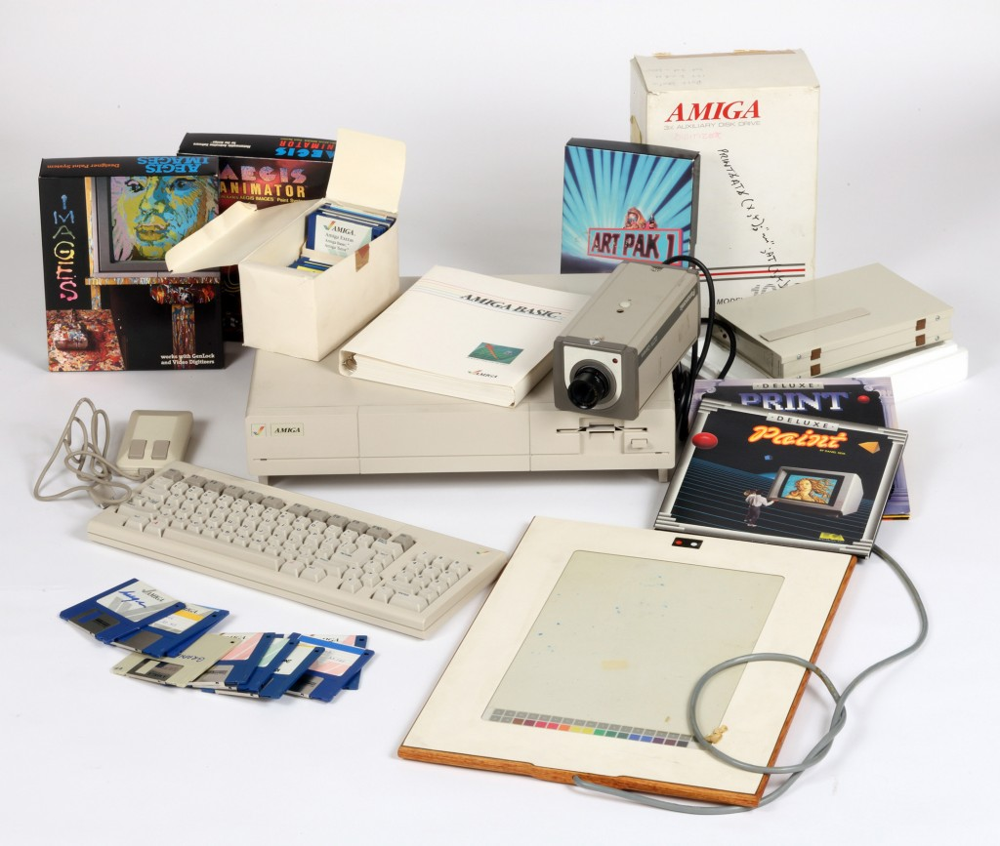

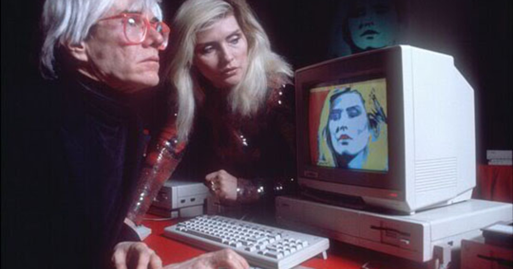

 
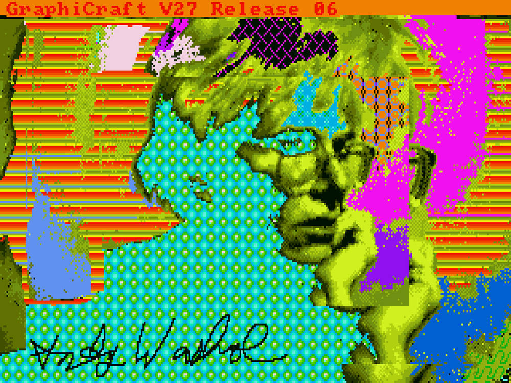

### Harold Cohen and AARON

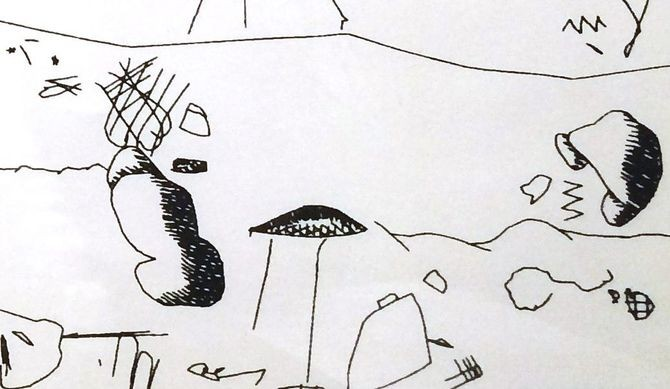

[videos of AARON](http://www.aaronshome.com/aaron/index.html)

### Art on the Web and new tools for visual programming

### Casey Reas

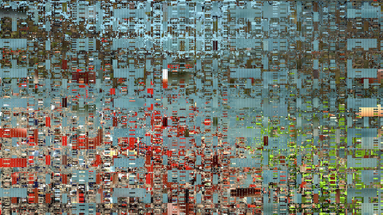

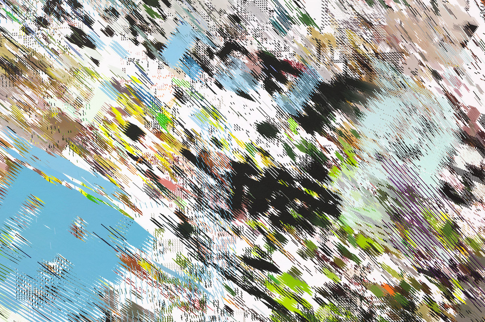

[Processing](http://processing.org)
