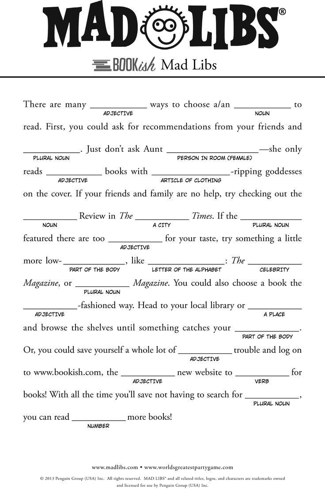
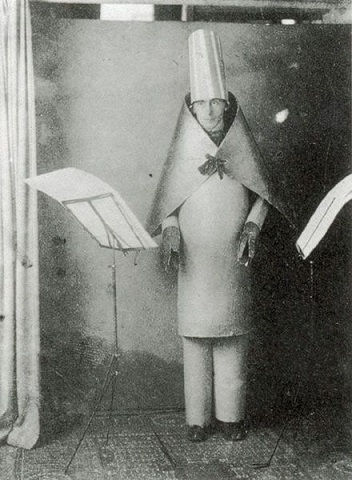

# Week 12

# Working with data

## Part 1: Strings 

### Text as data

This semester we have primarily worked with numeric values (integers, floats) and booleans (true/false) as variables.

We already know how to style text through working with fonts, and changing text size.

```
var customFont;

function preload() {
  customFont = loadFont('camo.otf');
}

function setup() {
  createCanvas(400,400);
  fill(200,10,120);
  textFont(customFont);
  textSize(36);
  text('Testing this font', 10, 50);
}
```

[code](https://editor.p5js.org/2sman/sketches/lTp1-QOME)


### Array of Strings

We call data made up of letters *Strings*. They can be individual words, a sentence, a paragraph, a page, a book or much more.

Just as we've stored values in arrays, we can also work with arrays of strings. We did this previously by creating an array of student names in the class and then picking a random name. ```var students = ['Alvin', 'Billie', 'Celia', 'Dwayne','Ellie', 'Fay'];```

```
var textList = ['even', 'a', 'stopped','clock','tells','the','right','time','twice','a','day'];
var wordNum = 0;
var wordX = 400;

function setup(){
 createCanvas(400,400);
  textSize(24);
}

function draw(){
  background(0);
  wordX -= 10;
  if (wordX < -20) {
    wordX = width + 20;
    wordNum++;
    fill(random(255), random(255), random(255));
  }
  if (wordNum == textList.length) {
    wordNum = 0;
  }
  text(textList[wordNum], wordX, height/2);
}
```

[code](https://editor.p5js.org/2sman/sketches/zY_KwcRJb)

### Working with Strings

p5.js has a number of built-in string functions. 

- join()
- match()
- matchAll()
- nf()
- nfc()
- nfp()
- nfs()
- split()
- splitTokens()
- trim()

These are used for manipulating strings, combining them, removing spaces or commas, transforming a sentence into an array of words, etc.

In the previous code sketch, I specified an array of words that I called textList, separating each individual word manually with a comma and surrounding them with quotes. We have other options to simplify working with whole strings, breaking them into an array of words.

We can take our previous example for example and separate the words using splitTokens()

```
textList =  splitTokens("even a stopped clock tells the right time twice a day");
```

We declare ```var textList = [];``` as a global variable and then use splitTokens to split our sentence, to initialize set our textList variable to the array of its individual words.

[code](https://editor.p5js.org/2sman/sketches/rk5u1xVqr)

### Combining Strings Generatively and Dada Computation

Javascript also makes it easy for us to concatenate (combine) strings.

You are probably familiar with the kids' storytelling word game Mad Libs where you fill in categories of words

  
Mad Libs  

There is a similar dada and surrealist practice to generate new texts.

Dadaism was an early 20th century art movement, based originally in Switzerland, then in New York and Paris. Dadaists rejected logic and reason in favor of the irrational or nonsense. Dada artists created collaged art and texts, poetry, visual arts, plays, sound poetry and sculpture. They rejected traditional notions of beauty and form.

Dadaist Tristan Zara developed a technique for creating a dadaist poem.

> Take a newspaper.
Take some scissors.
Choose from this paper an article the length you want to make your poem.
Cut out the article.
Next carefully cut out each of the words that make up this article and put them all in a bag.
Shake gently.
Next take out each cutting one after the other.
Copy conscientiously in the order in which they left the bag.
The poem will resemble you.
And there you are--an infinitely original author of charming sensibility, even though unappreciated by the vulgar herd. 

William Burroughs made use of this technique when he wrote his famous book Naked Lunch.

### In-class Experiment: Make your own Dadaist Poetry Generator

...

#### Loading Strings

In our previous example sketches we loaded a sentence as an array, or manually entered a literal array. What if we want to load in a page or a whole book to select from?

Just as we've been able to load in external photo image and soundfiles we can also load in text files. There are methods to load in strings, csv (comma separated values - like individual cells in a spreadsheet), or other more complex data files called json.

Using loadStrings you can load in a text file so that each sentence of that file becomes a separate element in the array.

There are free books available online at [Project Gutenberg](https://www.gutenberg.org/). You can also find *corpora* (plural of corpus, collections of categorized words) compiled by artist/researcher Darius Kazemi on [his GitHub](https://github.com/dariusk/corpora).

To load strings into a variable we use the ```loadStrings()``` method.

```
var result;
function preload() {
  result = loadStrings('textFile.txt');
}

function setup() {
  background(200);
  var phrase = floor(random(result.length)); //random number produces a float and we need to round it so we round down with floor
  text(result[phrase], 10, 10, 80, 80);
}
```

[example code](https://editor.p5js.org/2sman/sketches/-VrUvlp8N)

More complex sentences can be created through combining multiple categories.

Nick Montford is an artist specializing in this technique.

### For further research:

#### History
- Tristan Zara
- Brian Gysin 
- William Burroughs
- Hans Arp
- Marcel Duchamp
- Hugo Ball

  
Hugo Ball performing sound art

#### Present

Present-day artists and spammers are the inheritors of this history. We can use the techniques of Dadaists' past to new ends.

- Horse_eBooks
- Allison Parrish
- Nick Montfort
- Taper
- Darius Kazemi
- Kate Compton - Tracery
- Twitter Bots
- Markov Chains


## Final Project

# Homework

1. Make a generated postcard, card, poem page or similar. The page should have some visual elements and emphasize the creation of an algorithmically-created story, poem, letter, haiku, etc. Pay attention to typography, sizing, composition. Use a corpora source to that will lead to fruitful results.
2. Create a project pitch for your final project. This should include a 3 paragraph description. Make sure to cite 3 research references for your work, at least one of which should be an artist that inspires your project. Put this information in a slideshow format with at least 3 slides and be prepared to present a short 5 minute presentation of your idea to get feedback on.


