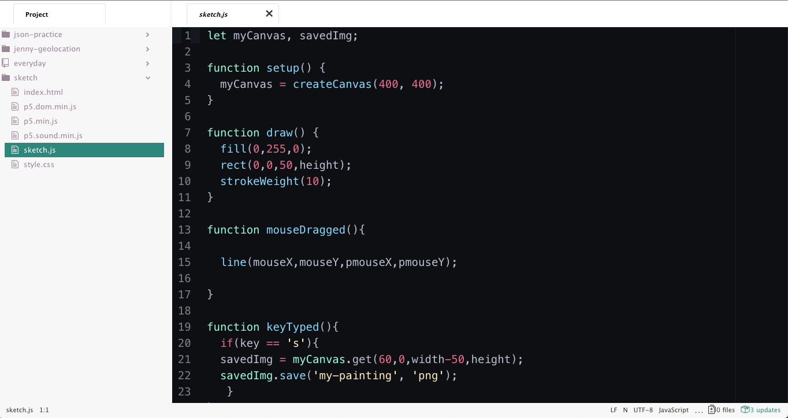

# Week 14

- check-in
- Working outside the Web Editor
  - using a text editor or IDE
  - using a local server
- Processing vs P5JS
- 3D space and WebGL
- in-class studio time 
  - pairs and 1-on-1 meetings: final project

## 3D Space!, WebGL and "Where Do I Go From Here?"

This is a module where we start to review what we learned this semester, which includes the basics of programming and the nuts and bolts of writing software.

We can peak beyond the limits of the web editor to see the entire [Web ecosystem](../week13) that enables our P5JS sketches to run.

we need a HTML page, with links to p5js and other p5 libraries like p5sound and p5dom for working with sound and the greater web (like the camera or other elements of a webpage) respectively.

The p5js web editor is great, but it has its limitations. If you are working on a more complex project, or you want to export and save your work locally for achiving on your computer it makes sense to understand how to work with p5js outside the browser web editor.

To export your code from the web editor, go to File > Download. **You may want to make a new folder first to hold the files, as it will export a lot of files!** The files will be downloaded in a single zip file that you have to unzip/uncompress. 

The files are:

- index.html - *this is the webpage that holds links to the p5js libraries and your sketch*
- style.css - *a minimal stylesheet that tells the browser to display the canvas with no border margins or spacing around it*
- p5.min.js - *the p5js library that tells a browser how to interpret your p5 sketch*
- p5.dom.min.js - *the p5js addon library that lets you write code to interact with other parts of the web outside the canvas, such as the camera*
- p5.sound.min.js - *p5js addon library for working with sound*
- sketch.js - *OUR SKETCH! The file we've been working in when we use the online web editor for example. Remember that this file is a Javascript file that relies on the p5js library(ies)*

Phew! That's a lot of files. If we are working with sound files, image filesor other text data files we might have even more files.


### Text Editor / IDE

When we code on our computer we use special software called a Text Editor. This is software meant to make it easy to code. There are dozens (actually, hundreds) of free and open source text editors available. We don't use Word for example because it adds in style information (bolding, fonts, etc). When we code, we don't want this information. There are also programs called IDEs, which stand for **Integrated Development Environment**. An IDE contains a text editor and additional features like a debugger and usually a compiler.

One good free open source editor/IDE for working in Javascript is [Atom](http://atom.io) by the makers of GitHub. Other noted editors are VS Studio, Brackets, SublimeText and many others.

Atom out of the box has a minimal setup. 

  
Atom Editor  

##### Project View / File Selector

On the left side is the Project View / File Selector. You can have multiple projects loaded up to work with in the editor. To add a project, go to File > Add Project Folder to add it to this pane. You can now click on a filename and it will open up for editing.


##### Edit Window

The right side by default is the editing window. When you click a file in the project view file selector it will open up here. You can edit and save files.

That's the basics of the editor!

##### Additional Features of the Editor

You can toggle line wrapping by going to View > Toggle Soft Wrap.

You can change the aesthetics of the editor and UI by going to Atom > Preferences and then clicking on Themes on a Mac. On a PC the Preferences or Settings might be in another menu.


#### Running your code in a local server

Due to browser security restrictions, web developers must use what's called a local server to emulate as if their website were located on a remote server, when they are testing their scripts. It acts as if you visited mywebsite.com/mysketch.js but instead you go to the file located on your computer.

To do this, we run what is called a *local server.* There are multiple ways to do this. The easiest is to add that functionality to Atom, as it does not come installed out of the box.

In Atom, go to Atom > Preferences and click Install. Then type in *Atom Live Server* and click the Install button. It will add a *atom-live-server* option to your Packages menu.

To use this, make sure you have your sketch and project folder open in the file browser on the left. It must be the top project open. If not open, go to File > Add Project folder. If another project is already open, drag the project folder up to the top. Now go to Packages > atom-live-server. It will launch a Chrome web browser and if all is successful show your running sketch canvas.

To view any errors and the Javascript console depends on what browser you are using. On Chrome, go to View > Developer > Javascript Console. In Firefox go to Tools > Web Developer > Web Console. This is where you'll see the contes of ```print()``` for example. If a file is not loading, it will list this here as well.

- [tutorial on p5js workflow with Atom](https://www.youtube.com/watch?v=HZ4D3wDRaec) and running a local server
- a [brief intro](https://p5js.org/get-started/) on p5js with Sublime Text
- [Working with p5js beyond the canvas](https://github.com/processing/p5.js/wiki/Beyond-the-canvas) 

## Processing Vs P5JS

[Processing](http://processing.org) was invented by Ben Fry and Casey Reas at the MIT Media Lab, based on Design By Numbers, and initially released in 2001. Processing is a programming language as well as the name of an Integrated Development Environment (IDE). It is a library for the language Java that simplifies the language, and like p5.js, orients the code around designing and sketching visually using code. When Reas and Fry released Processing originally they chose Java because at that time Java *applets* could be run in web browsers. Due to web browser restrictions this is no longer the case.

p5.js was initially created by Lauren McCarthy in 2013 as a way to build a web-native approach to Processing. It is technically a library in Javascript and runs on a webpage in a web browser.

The [Processing Transition](https://github.com/processing/p5.js/wiki/Processing-transition) article explains some of the key differences between coding in p5js and Processing. Some of these major differences include: 

##### Asyncronous (p5.js) vs Syncronous (Processing)
p5.js is Javascript and thus is an asynthronous language. Although code is written sequentially, even if a line of code hasn't finished executing, the next line of code will begin running. This is why we use preload and callbacks in p5.js. In Processing no preload is necessary as all lines of code (such as loading an image) must finish before the next line may begin.

##### Type Declaration 
Java is a language requiring type declaration. When you create a variable in Processing, you must specify the kind of variable you need. For example, these could include int (integer), bool (boolean), float (decimal percentage). In p5.js all variables are created with var and functions, images, strings, etc can all be stored as vars.

##### Libraries
Processing is older so there are a number of libraries available specifically to use with it. You can load these from inside the Processing IDE. These include libraries for working with video, sound, the Kinect and much more. p5.js has just a few dedicated libraries at this time (including p5.play for creating games), but additionally it can work with almost any other Javascript library if you integrate them together in your code.

##### Desktop vs Browser
The most obvious difference is that Processing works in the Processing Editor and creates desktop java applets/applications. Out of the box, p5.js works in the web editor or on websites. With more advanced knowledge you could compile a p5.js sketch along with a web browser to make an Electron app that serves as a desktop application.

###When to use Processing or p5.js?

Processing is better for creating desktop apps, working with hardware (Raspberry Pi, or Arduino with Firmata library), creating more robust applications, working with legacy code, and for more camera pixel manipulation without browser restrictions. 

p5.js is better for creating projects that live on and integrate with the web.

### WebGL and working in 3D space


- [Getting Started with WebGL in P5JS](https://github.com/processing/p5.js/wiki/Getting-started-with-WebGL-in-p5)
- [WebGL Tutorial playlist](https://www.youtube.com/watch?v=nqiKWXUX-o8&list=PLRqwX-V7Uu6bPhi8sS1hHJ77n3zRO9FR_) on The Coding Train
