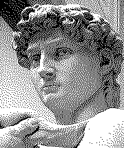

# Week 4

- questions?
- review importing images
- image quality
- fonts!
- timers with millis()
- rotation
- rollovers

# Questions

How to create a randomizer that will place an image in 1 of 4 different corners?

[Link](https://editor.p5js.org/2sman/sketches/vnBIjyxG9)

# Resource: Bouncing things!

- Need more help with the bouncing ball?
- Check this new [Coding Train tutorial](https://www.youtube.com/watch?v=0j86zuqqTlQ) to recreate a bouncing DVD logo

# Images: Talkin' bout resolution

File size impacts how fast your software loads. And since our code sketches live online in a web browser, they impact how fast your website or web app loads. Big files slow this down. You can compress images, but it's helpful to understand the big 3 image file types, their advantages and disadvantages.

### When to use Gif, Jpeg, Png

##### Jpeg

- 'Joint Photographics Experts Group'
  - defined in 1986!
- reduces file size
- lossy! = some data/quality is lost in the compression
- can display millions of colors
- ideally for reducing an image 60-75%
- standard image file type for across platforms, cameras, browsers, etc

#### Gif

- 'Graphics Interchange Format'
- 256 indexed colors
- this is a lossless format of limited colors
- great for sharp-edged images, with limited colors
- can loop!
- uses dithering, a process where limited colors are used in a technique to appear as if there are a larger depth of colors

  
although only black squares are used, the image appears to show a range of grayscale

  
only red and blue are used but as the squares shrink they appear as purple

### PNG

- 'Portable Network Graphics'
- lossless
- intended to compete with and be better than Gif!
- full color
- transparency supported!


### Which to use?

- Most of the time: Jpeg!
  - Compressed. Small
- Need transparency?
  - Png
- Need a looping image? or small 8bit image?
  - Gif

#### Compression options

- Check an image's file size. On the Mac, click on the file. Go to File > Get Info, and check out the size
- Photoshop -> Save For Web and Devices
  - On a screen, the max resolution is 72 dpi
- On a Mac, use Preview to open the file. File > Export and choose jpeg, png or gif and amount of compression.


## Fonts!

We've covered how to get text on screen with the ```text()``` command, and how to set text size with ```textSize()```

p5js also allows us to load custom fonts.

Just like with image files, there is a 5 step process:

1. Find a font, .otf or .ttf file. Download it.
2. Upload it into your sketch's project folder
3. Create a global variable to hold your font
4. use ```loadFont()``` to load the font in your variable in the preload
5. Use the font with ```textFont(yourFontName)```, replacing yourFontName with whatever variable name you chose

```
var customFont;

function preload() {
  customFont = loadFont('camo.otf');
}

function setup() {
  createCanvas(400,400);
  fill(200,10,120);
  textFont(customFont);
  textSize(36);
  text('Testing this font', 10, 50);
}
```

[link](https://editor.p5js.org/2sman/sketches/lTp1-QOME) to example code sketch in the web editor

**Be careful: The web editor won't dislpay the sketch properly if you have spaces in the font file's name**

Some things to keep in mind. Your font can be an .otf, .ttf file saved locally, or at a URL online. This is an asynchronous operation, so it's best to load the font in ```preload()``` to make sure the font is ready by the time you start drawing text to the screen.

Note that some browsers block loading fonts from another URL for security reasons.

- Loadfont [reference](http://p5js.org/reference/#/p5/loadFont) page

There are many places to find fonts. One of the most active ones is [DaFont](https://www.dafont.com/).


# Rollovers (buttons)

For our bouncing ball, we needed to detect when we were on the page or not. This same technique can be used to detect when a user has clicked on a button.


First we see if our mouse has rolled over the rectangle

```
function setup() {
  createCanvas(400, 400);

  rectMode(CORNER);
}

function draw() {
  background(220);

  rect(150,150,100,100);

  if (mouseX >= 150 && mouseX <= 150+100 && mouseY >= 150 && mouseY <= 150+100) {
  //if we've rolled over do something
    fill(0);
   } else {
		fill(255);
   }

}
```

How do we take this code and alter it so that the button changes color only when we press the mouse?

Answer: place the code inside a test for whether the mouseIsPressed


- [simple button example](https://editor.p5js.org/2sman/sketches/-PS2iOCsO)

- more advanced [rollover button example code](https://editor.p5js.org/2sman/sketches/99erQyzKh)

# Multi-week Assignment: Make a drawing tool

## Part A due next week: Feb 22
## Part B due in two weeks: Mar 1

Software like Adobe Photoshop appears at first to have infinite possibilities. In actuality it is constrained and specific. You can only do what the software allows you to do.

As long as artists have been making art, they have been inventing, designing, and altering their tools.

Becoming a programmer is often equated in our culture to developing *magical powers* or unlocking new abilities. Let's embody this idea with the challenge to create our own art-making tools. For this assignment, consider what we have learned this semester, as well as the history of artist's software tools.

In the p5js web editor, create your own custom art-making tool. Consider color, brushes, images, buttons, text.

Start on paper in your notebook. What is the purpose of the tool? What is the interface? How will someone know how to use your tool? Is your tool intended for you or for someone else? Start doing very simple sketching of the tool and its functionality.

Remember that someone can right click on the canvas to Save As > image. But you can also build in a button, mousePress or keypress for saving an image of the canvas with the ```save()``` or ```saveCanvas()``` command.

- [save](http://p5js.org/reference/#/p5/save) reference page

### Part A - due Feb 22

1. In your notebook or on the computer sketch out your software. What will things look like?
2. What is the purpose/goal of your software?
3. Sketch out the interface in your notebook, on the computer. Build a first version of your interface in code.

### Part B - due Mar 1

### Final Requirements

1. A catchy title
2. A short description
3. Screenshots of the tool/software
4. Documentation of how to use the software
  - optional: short video screencast of you demonstrating your software
5. Ability to save with your software
6. Create a folder of representative 'good' images that you'd want to demonstrate. There should be at least 3 works (saved screenshots) made with your tool.

### Tools
a [list](https://github.com/justanothersystem/tools) of experimental web-based drawing tools

## Homework

- Read Chapter 6, Translate, Rotate, Scale
- Read Chapter 7, Media
- Part A of Art Toolbuilding
