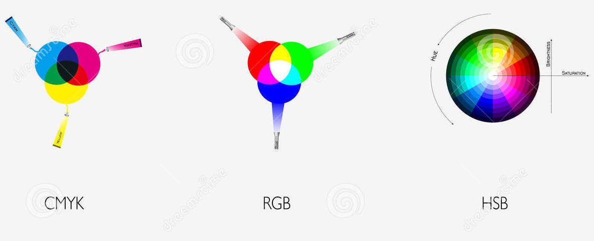

# Week 5

- questions?
- HSB, the other color mode
- functions
- passed parameters with functions
- translation, scale, rotation
- arrays

## HSB Color Mode



HSB stands for Hue, Saturation, Brightness. So far we've been coding with RGB values.

You can change the color mode using the ```colorMode(HSB);``` command, which will change the way you enter parameters for fill(), color(), stroke() and background(). The default of p5js is ```colorMode(RGB);``` You can also specify a value range. For example,

```
colorMode(HSB, 100); // Use HSB with scale of 0-100
var c = color(50, 55, 100);
fill(c);
```

### Transparency with Alpha Value

We've been using RGB values, but we also have the option of specifying an A value. A stands for alpha channel, and its a measure of how transparent/opaque an image is. Its value varies the same as your other color value range (default: 0 to 255)

example ``` background(200,0,0,120); ``` will draw a faded red background

### Modularity with Custom Functions


So far we've been using the builtin functions preload(), setup() and draw(). We've also covered event functions like mousePressed() and keyPressed(). Our programs are starting to get longer. And we're starting to use if statements to create more complex program flows.

With increased functionality, our programs could become harder to organize. If our draw() loop is one giant block of code, it's quite difficult to debug. Almost all programming languages add an ability to make a modular unit block of packaged code. This can sometimes be called a subroutine. In p5js and most modern languages, we call a named block of code a function.

example

```
//defines the createPlanet function

function createPlanet(){
  fill(random(255),random(255),random(255));
  ellipse(random(width),random(height),20,20);
}

//below this is the place that actually calls
//(runs) our createPlanet function block

createPlanet();
```

Why do we create our own custom functions?
- anytime you want to repeat a certain block of code, it helps to only have to write the entire thing out once. You can then call that function anywhere you want it to run.
- creating functions makes our code modular. We can easily fit function calls (running a function) within if/else statements for example.
- It helps us with debugging. We can more easily turn on and off specific functions when testing.

## Functions with Parameters

So far, our functions have always had a pair of twin parenthesis () after their name. This is where we can pass in variables to be used by a function.

We create a temporary variable name that will hold any passed in value. Then we use that variable name in our function somewhere. When it's called in the function, it will substitute in the *passed in* value. This might become clearer with some examples:

Example

```
function helloPerson(name){
  print("Hello "+name);
}

helloPerson('Rebecca');//prints 'Hello Rebecca'
helloPerson('Jerome'); //prints 'Hello Jerome'
```

Note that the quotes are necessary around the names passed in above. Without the quotes it assumes Rebecca and Jerome are variable names and will spit out an error in the console saying that Rebecca and Jerome are undefined.

### In-class practice with passing parameters

Create a face function that is called when you click a button. Choose a random color background, add eyes and a mouth. Each face generated should be slightly different. Pass in parameters for the x, y position, color, and anything else you'd like to add.

Example code for [Don't Worry Be Happy face function](https://editor.p5js.org/2sman/sketches/9KtfA_JDg)


### Translate

Changes the grid of the canvas to a new starting x and y location.


```translate(50,100);``` will have the new canvas start at the 50, 100 location. Any further coordinates given after this point will be in relation to this new starting point.

Note that it resets at the beginning of the draw loop. You can use translate multiple times in the draw as well, and each will offset the canvas additively.

example


```
function setup(){
  createCanvas(400,400);

  translate(50,100);
  rect(0,0,100,50);
}
```

### Scale

Changes the scale of the canvas. In essence, it stretches it out. a ```scale(1)``` is the default. ```scale(2)``` stretches the canvas twice as big. Resets at the beginning of the draw.

### Rotate

Rotation of the entire canvas.

Rotation is done in radians. Or can be set to use degrees by specifying ```angleMode(DEGREES)``` before, in the setup for example.

To rotate an object in the center, move the canvas to that object's starting position.

```
function setup(){
  createCanvas(400,400);
  angleMode(DEGREES);
  rectMode(CENTER);
}
function draw(){
  translate(50,50);
  rotate(mouseX);
  rect(0,0,100,100);
}
```

### Push and Pop

Push and pop are used to pop on new temporary independent coordinate systems.

[code example](https://editor.p5js.org/2sman/sketches/2u1U1Gmhb)

```
 push();
  translate(100,100);
  rotate(mouseX);
  rect(0,0,50,50);
  pop();
```

## Web-Based Artists Review


For the next few weeks we'll talk about a few contemporary interactive media artists whose work lives on or dialogues with the Internet and whose work is built in code. We'll concentrate on artists that are part of the current exhibition [The Art Happens Here: Net Art's Archival Poetics](https://www.newmuseum.org/exhibitions/view/the-art-happens-here-net-art-s-archival-poetics) currently on view at The New Museum until May. I recommend you go see the exhibition, not only because it's a good exhibition but also because the show is made up of a diverse community of artists!

There is a great [New York Times](https://www.nytimes.com/2019/01/23/arts/design/internet-art-new-museum-rhizome.html) writeup of the exhibition.


Today we'll examine the work of:

- [Morehshin Allahyari](http://www.morehshin.com/)
- [Corey Arcangel](http://www.coryarcangel.com/)
- [Entropy8Zuper](http://entropy8zuper.org/godlove/) (Auriea Harvey and Michael Samyn)
- [Shu Lea Cheang](http://mauvaiscontact.info/)
- [Olia Lialina](http://art.teleportacia.org/)
- [Brian Mackern](http://bri.uy/)
- [Bunny Rogers and Filip Olszewski](https://rhizome.org/editorial/2019/feb/14/an-ice-palace-in-queens/)

# Continued work on your own drawing software
- in-class studio time
- testing of your code by your classmates

# Homework

Create a draft version of your Drawing Tool.
- see [week 4 notes](../week4/) for the list of project requirements.
- We will be doing user testing in class.
- Create a draft version of your tool. Submit your code and a (good) example drawing made with it that shows off the capability of your tool.

# BASIC DRAWING TOOL EXAMPLE

[HERE](https://editor.p5js.org/2sman/sketches/hXhUGMhTp)

## Resource

I publish an ongoing updated list of art and technology events happening in the New York City area called [DART](http://dart.fyi).

## Reading Response
Read two of the following:
- [The Secret History of Women in Programming](https://www.nytimes.com/2019/02/13/magazine/women-coding-computer-programming.html)
- [Finding Lena: The Patron Saint of JPEGs](https://www.wired.com/story/finding-lena-the-patron-saint-of-jpegs/)
- [New Emojis are Coming: Interracial Couples, Guide Dogs, Falafel and More](https://www.nytimes.com/2019/02/06/technology/new-emoji.html)

- Write a short response on the readings you choose. You do not need to summarize the readings but instead respond to anything that provoked or moved you or that you found interesting.
