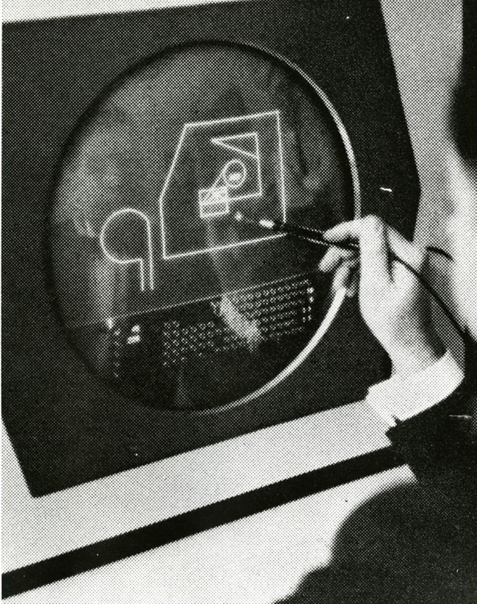
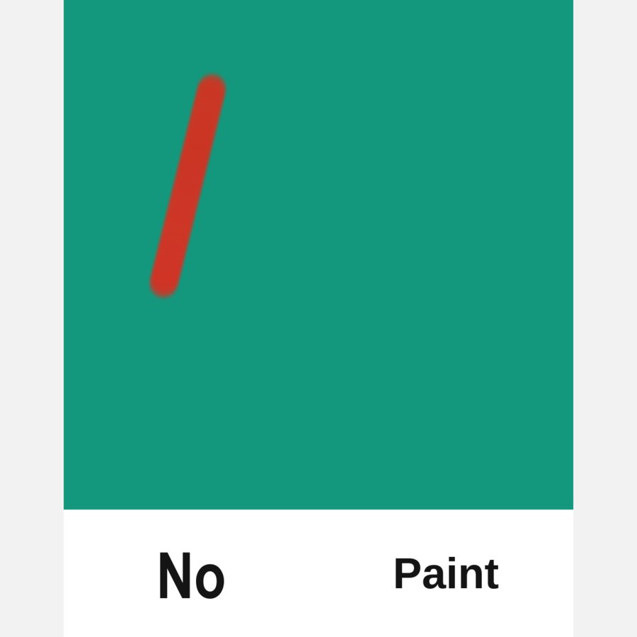
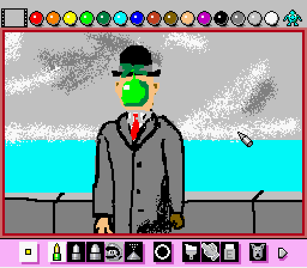

# Week 6

#### Today's class
- Technology and Interactive Media Careers
- arrays
- grids
- studio time
  - booleans for button presses
- bonus content: map, constrain

# Careers Panel

March 7, 5-7pm in The Red Room

[Technology and Interactive Media Careers Panel](https://www.purchase.edu/live/events/16030-technology-and-interactive-media-careers)

with Cassie Tarakajian (Cycling 74, Processing/p5js), Campbell Watson (IBM Research), Genevieve Hoffman (TOPOS), Linda Chang (BlueSky Studio)

# Array Review


Arrays have length. The length equals the total number of values in the array.

```
var students = ['Doug', 'Ariel', 'Shona', 'Natasha', 'Jerome'];
```

The **length** of students is 5 since there are 5 entries. The first element is the 0 element of the array.

```print(students[0]); // 'Doug'```

Counting up from 0, we can see that the last element in the array is the 4th.

```print(students[4]; //'Jerome'```

Extrapolating from here, this tells us that the last element in any array is length - 1.

```
print(students[length-1]);
```

Choose a random student from an array

```
var pickAStudent = int(random(students.length-1));
```

[Example code](https://editor.p5js.org/2sman/sketches/SUUlWhE9n)

[An array of button images](https://editor.p5js.org/2sman/sketches/jmO0KwSD-)

# Drawing a grid with loops

single line of rects with a single for loop

```
for (let x=0;x<width;x+=20){
    rect(x,height/2,20,20);
}
```

[code](https://editor.p5js.org/2sman/sketches/Rx5053gin)

nested for loops

[code](https://editor.p5js.org/2sman/sketches/XdV_uJonn)


# Pixel Arrays

[example pixel array gradient](https://editor.p5js.org/2sman/sketches/ar0z_izTs)

# Tool Time - Drawing With Computers

### Sketchpad and the birth of the GUI

Ivan Sutherland invented the Graphical User Interface in 1963. Prior to this, you only interacted with a computer via switches or a keyboard. The sketchpad interface featured switches, dials, an output display and a lightpen that could draw directly on it. A user pressed switches while drawing. One switch allowed touching the screen with the lightpen to draw a line from the previous position on screen. Another switch drew circles. Another drew arcs. Etc. This allowed a user to draw directly on screen without having to specify position in code commands. There were also capabilities for duplicating, moving, scaling and rotating shapes on screen.

Sketchpad was a new way of working and contained constraints that shaped what could be created with the software. In the 80s as home desktop computers spread, Adobe Photoshop, Illustrator and InDesign became standard tools for manipulating photos and print design. These powerful tools have become standardized within creative industries. In the past few years they have added in scripting capabilities to extend the available tools within these software systems.



[Sketchpad in action](https://www.youtube.com/watch?v=3wrn9cxlgls)

## New art software

### Emoji Ink


[Yung Jake](https://www.nytimes.com/2017/07/26/style/emoji-portraits-yung-jake.html) in the New York Times
- [an article](https://monicaheilmanart.com/inspiration/emoji-ink/) on Yung Jake's Emoji Ink
- [Emoji Ink](http://emoji.ink/)

### No Paint



Jeffrey Scudder's [No Paint](https://nopaint.org.jas.life/)
- [Soft Wallpaper](https://appadvice.com/app/soft-wallpaper/1390237091) in the iOS App Store

### Mario Paint



### Kid Pix


# User Testing

Try playing the original Apple II [Kid Pix - emulated in browser](https://archive.org/details/KID_PIX_DOS).

Try out [No Paint](https://nopaint.org.jas.life/).

Try out [Emoji Ink](http://emoji.ink/).

- How does the software make its interface clear? (or not)
- How does the software constrain your drawing/art-making?
- Is it intuitive?
- Would you do anything differently? If so, what?
- Would you want to use this again? Why or why not?

Now user test each other's software and ask and answer these same questions.


# Watch
- The Coding Train [What Is An Array?](https://www.youtube.com/watch?v=VIQoUghHSxU)
- [Arrays and Loops](https://www.youtube.com/watch?v=RXWO3mFuW-I)
- The Coding Train [videos](https://www.youtube.com/watch?v=bkGf4fEHKak&list=PLRqwX-V7Uu6aKKsDHZdDvN6oCJ2hRY_Ig)
- Optional: [map() function](https://www.youtube.com/watch?v=nicMAoW6u1g)
- [2D arrays](https://www.youtube.com/watch?v=OTNpiLUSiB4) aka creating a grid with nested for loops

# Finish your drawing/painting software

### Final Requirements

1. A catchy title
2. A short description
3. Screenshots of the tool/software
4. Documentation of how to use the software
  - optional: short video screencast of you demonstrating your software
5. Ability to save with your software
6. Create a folder of representative 'good' images that you'd want to demonstrate. There should be at least 3 works (saved screenshots) made with your tool.

### Resource
- [simplest rollover a button example](https://editor.p5js.org/2sman/sketches/-PS2iOCsO)
- example code: [Simple Painting with a single 'erase' button](https://editor.p5js.org/2sman/sketches/W_vDcXZ9q)
- [example code](https://editor.p5js.org/2sman/sketches/hXhUGMhTp) for a painting tool with multiple buttons, using booleans to determine what button was pressed
- a [list](https://github.com/justanothersystem/tools) of experimental web-based drawing tools
