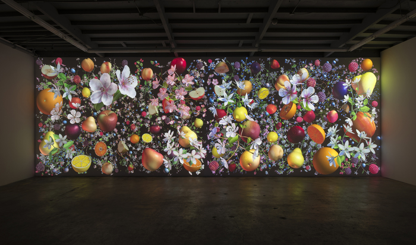

# Week 8

- Check-in
- review loop works
- Working With Sound
- Working With Video
- Classes and Objects


##### Loop Works to review

[Christian loops](https://editor.p5js.org/c.dibene/full/-FxP2jGJP)

[Matthew loops](https://editor.p5js.org/carvosfire13/full/xj5YOYoJv)

[Graham loops](https://editor.p5js.org/grachor9823@gmail.com/full/KMkqAGj6p)

# Sound

So far, we have only been using programming to create visual artworks. But p5.js also features a sound library, called p5Sound that allows us to work with sound in our sketches. Sound adds an extra dimension, potentially helping to place us more fully in an immersive experience. It can also serve just as accompaniment, or as a fundamental part of our work.

Working with sound is quite similar to the process of working with imported images.

1. Load the sound into the editor
2. Create a global variable to hold the sound file.
3. Load the sound file in your preload function (or use a *callback* function that runs only after your sound loads).
4. NEW: begin playback of that particular sound file somewhere using ```.play()```.

```
var mySound;

function preload() {
  mySound = loadSound('doorbell.mp3');
}

function setup() {
  mySound.play();
}
```

We don't play mySound.play() in our draw() function because we only want the sound to play once. If we place it in draw, it will trigger a new playing of the sound every time the draw() function is called.

A few other sound-specific methods:

- ```isLoaded()``` will return the boolean ```true``` if the sound file has loaded already.
- ```isPlaying()``` will return true if the sound file is currently playing. This is really useful for toggling sound on and off. Use an if statement to detect if a sound file is playing, and then choose to play it if it's currently false.
- ```setVolume()``` between 0.0 (silence) and 1.0 (full volume)
- ```.play()``` starts playback of a specific sound file
- ```.stop()``` does what you think it does
- ```.loop()``` begins looping playback of a soundfile
- ```.pause()``` pauses the file. Start it again with ```.play()```

### playMode

And lastly, an important one:
- ```playMode()```, which has three potential arguments, ```restart``` or ```sustain``` or ```untilDone```. By default, the playMode is sustain. In sustain mode, each time play is called, the program will play the full sound file from start to finish, which means any previously-started playing of the same sound file will be heard simultaneously until it has ended playing. In restart mode, if the sound file has already been playing and you call play on that sound again, it will stop the previous and start playing the soundfile from the beginning again. Lastly, if playMode is untilDone and you call play on a soundfile, it will only start playback if it's not currently playing.

- These and additional [sound file commands/methods](http://p5js.org/reference/#/p5.SoundFile) can be found in the p5Sound reference.

```
//example of toggling a song on or off when you press the mouse
var song;

function preload(){
  song = loadSound('freebird.mp3');
}

function setup() {
  createCanvas(720, 200);
  text("click to play",50,50);
}

function mousePressed() {
  if (song.isPlaying()) { //remember, this is the same as writing if (song.isPlaying() == true){ };
    // .isPlaying() returns a boolean true in this instance
    song.stop(); //so stop playing it
  } else { //otherwise, it wasn't playing
    song.play(); //so start playing it!
  }
}
```

##### Note:

Web browsers have just recently begun to be set to ignore autoplaying sound and video on the web, even if we've specified that we want a sound file to start playing in the setup(). They have done this to try to curb on the amount of auto-playing sound that plagued the internet, particularly advertisements. To play audio going forward, you'll have to have a user click first.

To get around this, many programmers are now adding a button or instructions to 'click to play' and then have your [[audio]] start playing once the user has clicked in the window.

Simple [example here](http://p5js.org/reference/#/p5.MediaElement/play)

# Video

Loading video works almost entirely the same as loading audio. Both are called 'media elements' in a web browser.

1. Load the file in your code editor
2. Create a global variable to hold the media file
3. Preload it in that variable in the preload (or if you load it somewhere else, you'll need to add a callback function to run after it successfully loads)
4. You can play the video with play

```
var vid;
function preload() {
  vid = createVideo('toothy.mp4');
}

// This function is called when the video loads
function setup() {
  vid.play();
}
```

[example code](http://editor.p5js.org/2sman/sketches/OtTKtDohH)

- Note: To position the video element on the page, you specify position with ```.position(x,y);```.
- More info on [createVideo](http://p5js.org/reference/#/p5/createVideo) options.


# Classes and Objects

We've previously discussed functions. They are modular chunks of code that can be called and run again and again. They help us make our code easier to follow, and can reduce typing.

Now we are ready to learn classes and objects, which go hand in hand. A class is also a modular, reusable bit of code. We can think of a class as a cookie cutter, and the objects that can be made from a class get *stamped out* like cookies. A class is used to specify a template for objects, which have their own data (variables) and functions.

For example, imagine we have the class Person. Each person has their own height, eyeFill color, name, for example. Jerome is a Person. He has his own height, eye color, name (Jerome). And all Persons have the function to walk() , talk() for example. Jerome has his own walk() which is a longer stride. Monique has her own height, eye color, name (Monique). She is a bit shorter and has a shorter stride in her walk().

By convention, we capitalize the first letter of the name of a class.

Example Class

```
class Bug {
  constructor() {
    this.c = color(random(255),random(255),random(255));
    this.x = random(width);
    this.y = random(height);
  }

  drawBug(){
     fill(this.c);
     ellipse(this.x,this.y,20,20);
  }
}
```

The Bug class will be used with our sketch. The rest of our sketch should look mostly familiar.

```
var cricket, spider;

function setup(){
  createCanvas(500,500);
  noStroke();

  cricket = new Bug();
  spider = new Bug();
}

function draw(){
  cricket.drawBug();  //the cricket has its own drawBug()
  spider.drawBug();   //& the spider has its own drawBug()
}
```

- [example code](https://editor.p5js.org/2sman/sketches/VVhE3MB4X)

How does a class work?

In our setup, we create two new bugs using the bug class. When a bug gets created, we are creating an *instance* of the bug class. When this occurs, the constructor part of the class runs first. We can think of this as the *setup* of the class. It creates the variables that will be used by the bug object. Since each object created by the class will have the same variables (with different values), we use this.x inside the class so that we know that the objects each have their own instance of the variables used. We normally set these variables in the constructor, then use them in methods below, which are functions that an object can use.


## Passing parameters to an object

Often when we create an object using a class, we need to specify certain information. For example, if we are making a Human, we may want to specify that the human Jean-Michel has height 72 inches. If we make another Human named Matilda, we may want to specify that she is 67 inches in height.


```
var JeanMichel, Matilda;

function setup(){
  jeanMichel = new Human(72);
  matilda = new Human(67);

  jeanMichel.announceHeight();
  matilda.announceHeight();
}

class Human {
  constructor(tempHeight) {
    this.h = tempHeight;
  }

  announceHeight(){
    print("They are "+this.h+" feet tall");
  }
}
```

Let's go back to our Bug class example to see an example of passing in multiple parameters.

```
var cricket, spider;

class Bug {
  constructor(x, y, bugColor) {
    this.x = x;
    this.y = y;
    this.c = bugColor;
  }

  drawBug(){
     fill(this.c);
     ellipse(this.x,this.y,20,20);
   }
}

function setup(){
  createCanvas(500,500);
  noStroke();

  cricket = new Bug(100, 150, color(30,240, 70));
  spider = new Bug(300,270,color(20,30,40));
}

function draw(){
  cricket.drawBug();
  spider.drawBug();
}
```

- [Example of class/objects with passed parameters](https://editor.p5js.org/2sman/sketches/zOqWNmbh1)

In-class Challenge: add a size parameter and specify a size to the class.


## Swarms, Intelligent Agents, Lots of Objects

##### Casey Reas


[Casey Reas Compendium series and lecture](http://reas.com/compendium_lecture/)

##### Jennifer Steinkampf

  

  
Loop

##### Mark Wilson

  
PSC 31, 2003

##### Ryoji Ikeda
  
test pattern

[Test Pattern no 6 video](https://www.youtube.com/watch?v=NIXOXs2vsV8)

[Test pattern installation](https://www.youtube.com/watch?v=XwjlYpJCBgk)

[Test pattern in Times Square](https://www.youtube.com/watch?v=JfcN9Qhfir4)

# Homework
- watch The Coding Train [video](https://youtu.be/T-HGdc8L-7w) on Classes and Objects

## Assignment - Autonomous Drawing Object
Goal: Create a generative artwork that uses classes and objects.

#### Part 1 - Due March 22

For this assignment, you are designing an autonomous drawing object. This is somewhat like a car that has driven through a puddle of paint, leaving a mark behind of its route. You must create a Class that will produce objects. The class will define an object with a shape, color, motion. Create a compelling class for objects that appear to have a mind of their own. Your class should contain enough variables so that each produced object has its own unique outcome, perhaps even making use of random, or perhaps using specified parameters, or both.

With a successful Class created, create instances of objects using that class. This will be a multi-week assignment. Create at least one class of autonomous drawing objects, and make several objects of that class. Have them draw.

#### Part 2 - Due March 29

Create several classes, each will produce a number of objects, using a for loop to create them in an array. Each class should have different colors, shapes, behavior, motions. The end result should be an interesting moving generative work.
